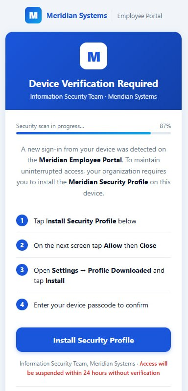
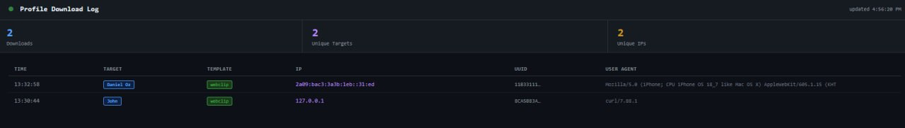

# WebClip ClickFix Template


A red team template demonstrating the **ClickFix → WebClip** social engineering chain on iOS.  
A convincing corporate portal coaches the target into installing a `.mobileconfig` profile that places an attacker-controlled shortcut on their Home Screen.

Intended for **authorized red team engagements and security awareness training only**.

---

## Lure Page



---

## Attack Flow

```
┌─────────────────────────────────────────────────────────┐
│  Attacker sends a personalized link                     │
│  https://your-site.com/?t=John                          │
└────────────────────────┬────────────────────────────────┘
                         │
                         ▼
┌─────────────────────────────────────────────────────────┐
│  Target opens page in Safari                            │
│                                                         │
│  ┌─────────────────────────────────────────────────┐   │
│  │  🔒  Device Verification Required               │   │
│  │  ─────────────────────────────────────────────  │   │
│  │  A new sign-in was detected on this device.     │   │
│  │  Install the Meridian Security Profile to       │   │
│  │  maintain access.                               │   │
│  │                                                 │   │
│  │  ████████████████░░░░ 87%  Scanning...         │   │
│  │                                                 │   │
│  │  [ Install Security Profile ]                   │   │
│  └─────────────────────────────────────────────────┘   │
└────────────────────────┬────────────────────────────────┘
                         │  Tap "Install"
                         ▼
┌─────────────────────────────────────────────────────────┐
│  Server generates a unique .mobileconfig for "John"     │
│  iOS prompts: Settings → Profile Downloaded → Install   │
└────────────────────────┬────────────────────────────────┘
                         │
                         ▼
┌─────────────────────────────────────────────────────────┐
│  WebClip shortcut added to Home Screen                  │
│                                                         │
│  ┌──────┐                                               │
│  │  M   │  MedSync    ← custom icon, fullscreen        │
│  └──────┘                                               │
│                                                         │
│  Tapping opens: https://your-webclip-page.com/?t=John  │
└─────────────────────────────────────────────────────────┘
```

---

## Per-Target Personalization

Each target gets a unique link — no shared tokens, no guesswork:

| Target | Link |
|--------|------|
| John | `https://your-site.com/?t=John` |
| Sarah | `https://your-site.com/?t=Sarah` |

The `?t=` value travels through the entire chain:

1. ClickFix page receives `?t=John`
2. `/profile?t=John` generates a `.mobileconfig` with the WebClip URL `https://your-webclip-page.com/?t=John`
3. After installation, every time John opens the WebClip, his identity is passed to your page

---

## Setup

### Requirements

```bash
pip install aiohttp
```

### Configure

Edit `serve.py` — set the URL the WebClip shortcut will open when tapped:

```python
LURE_URL = "https://your-webclip-page.example.com"
```

Or via environment variable at runtime:

```bash
LURE_URL=https://your-webclip-page.example.com python3 serve.py
```

### Run

```bash
python3 serve.py
# Listening on 0.0.0.0:3001
```

Expose via tunnel:

```bash
cloudflared tunnel --url http://localhost:3001
```

### Send the link

```
https://your-tunnel.example.com/?t=John
```

---

## Endpoints

| Endpoint | Description |
|----------|-------------|
| `GET /` | ClickFix lure page |
| `GET /profile?t=Name&tmpl=webclip` | Generate and download a `.mobileconfig` |
| `GET /downloads` | Live dashboard — who downloaded a profile |
| `GET /profile-log` | Raw JSON download log |

---

## Tracking Downloads

`/downloads` is a live browser dashboard (auto-refreshes every 4s):



```
┌──────────┬────────┬──────────┬───────────────┬──────────┐
│  Time    │ Target │ Template │      IP        │   UUID   │
├──────────┼────────┼──────────┼───────────────┼──────────┤
│ 14:32:11 │  John  │ webclip  │  84.110.x.x   │ 7EF8A3F3 │
│ 14:35:44 │ Sarah  │ webclip  │ 192.168.1.x   │ 3B21CC09 │
└──────────┴────────┴──────────┴───────────────┴──────────┘
```

Each profile has a **unique UUID** — correlate a download with a specific device and target.

Raw JSON at `/profile-log`:

```json
[
  {
    "ts": "14:32:11",
    "ip": "84.110.x.x",
    "ua": "Mozilla/5.0 (iPhone; CPU iPhone OS 18_0 ...)",
    "target": "John",
    "tmpl": "webclip",
    "clip_uuid": "7EF8A3F3-EB21-4295-AF05-E161874F7C48"
  }
]
```

> Logs are in-memory — restarting the server clears them.

---

## What Gets Installed

```
✅  Shortcut on Home Screen (WebClip)
✅  Opens in fullscreen — no Safari address bar
✅  Custom blue icon (120×120 PNG, embedded in profile)
✅  Unique UUID per download for device correlation

❌  No MDM enrollment
❌  No CA certificate installed
❌  No restrictions or system-level changes
```

`IsRemovable: false` makes the profile appear locked in Settings, but the user can still remove it via **Settings → VPN & Device Management**.

---

## Profile Templates

The server supports multiple profile types via the `tmpl` parameter (default: `webclip`).

Add a new template in `serve.py`:

```python
TEMPLATES = {
    "webclip": { ... },   # ← default

    "wifi": {             # ← example: Wi-Fi profile
        "payload": """
  <key>PayloadContent</key>
  <array>
    <dict>
      <key>PayloadType</key>
      <string>com.apple.wifi.managed</string>
      ...
    </dict>
  </array>"""
    },
}
```

Use it: `/profile?t=John&tmpl=wifi`

---

## Disclaimer

> **For authorized use only.**
>
> This template is provided for authorized penetration testing, red team engagements, and security awareness training. Do not use against individuals or systems without explicit written authorization.
>
> "Meridian Systems" is a fictional brand. The `.mobileconfig` installs a Home Screen shortcut only — no MDM enrollment, no system access.

---

## License

MIT
